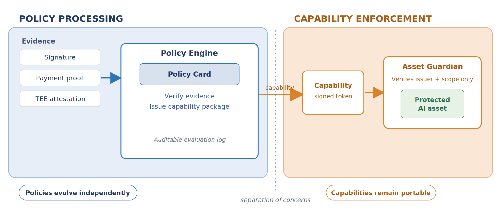
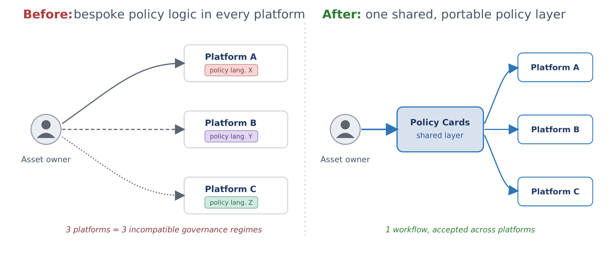
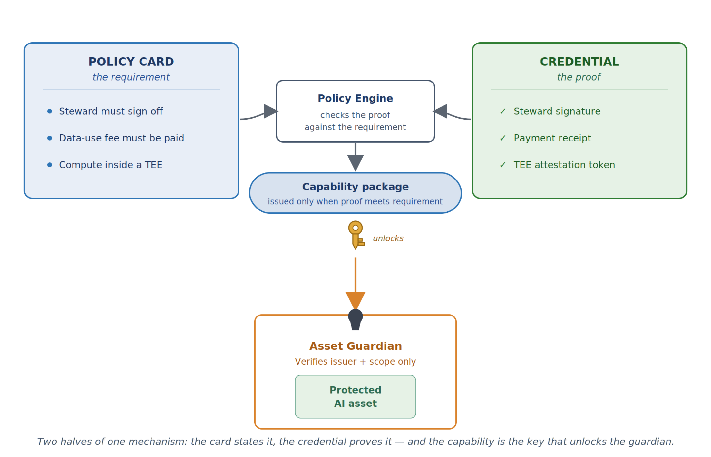

# Policy Fabric 101

*Policy Fabric is an open, community-driven reference implementation of decoupled AI governance. It packages governance requirements as machine-readable Policy Objects and the evidence that satisfies them as Verifiable Credentials, so that policy processing (i.e., evaluating evidence against requirements) is cleanly separated from capability enforcement (i.e., gating access to protected assets). It is written for governance engineers, platform operators, auditors, and domain working groups building data, model, and agent workflows across institutional boundaries.*

## Home

This section describes Policy Fabric at a high level; the problem it tries to solve and its value proposition.

### The problem: Fragmented Governance

Most user platforms today bake their governance rules — who may use an asset, for what, and under which conditions — directly into their own infrastructure. That coupling makes governance brittle:

1. **Governance is baked in applications:** changing a rule means reconfiguring or redeploying systems.
2. **Incompatibility across systems**: similar requirements end up expressed in incompatible ways across platforms.
3. **Difficult auditing**: Outside auditors cannot easily confirm that the stated rules are the ones actually enforced.

### The Solution: Policy Fabric

Policy Fabric is a community-driven effort that provides an architectural blueprint that addresses the governance fragmentation problem, and provides a reference implementation of the proposed architecture. Policy Fabric is not a new tool; it is a proposed organization of existing tools. It mainly rests on a simple architectural shift: separating policy processing from the point of policy enforcement, as shown in Figure 1.



*Figure 1. Policy Fabric's core move: policy processing (left) is separated from capability enforcement (right), so either side can change without disturbing the other.*

On the policy processing side, policy-as-code objects encode governance rules, and a Policy Engine evaluates the evidence a user presents against these policy objects. When every policy requirement is met, the policy object issues a short-lived, cryptographically signed capability package authorizing the requested action. On the enforcement side, an Asset Guardian checks only the capability package's signature and scope and applies it — it holds no policy logic of its own.

This has an the following advantages:

1. **Decoupled governance**: governance can evolve by updating policy objects, without touching the applications that enforce it. An application, following the Asset Guardian design, enforces policies by just consuming a capability package signed by an associated policy object. A capability package is only issued and signed if the encoded governance rules in the associated policy object are satisfied.
2. **Interoperability and Consistency**: The policy engine, and the notion of policy-as-code objects, constitute a unified layer for processing and encoding governance requirements. Multiple organizations will be able to communicate with the same language/protocol when expressing governance rules, and applications indirectly enforce these governance rules using a common capability-based enforcement design.
3. **Out-of-the-box privacy-preserving auditability**: The policy engine, by design, will record every interaction **without storing private information**. Records include the interactions of issuing a capability package in exchange for evidence submitted by requestors. So authorized auditors can use the policy engine to track what happened and who got access to what.

The next section introduces the main components described in the Policy Fabric blueprint.

### Policy Fabric Core Concepts

The four main elements of Policy Fabric are:

- **Policy Engine**: The backend where policy objects are executed. More details can be found in the [Policy engine](#policy-engine) section below.
- **Asset Guardian**: A software component that gates a protected asset or operation. It is where the point of enforcement happens. More details can be found in the [Asset Guardians](#asset-guardians) section below.
- **Policy Object**: A machine-readable policy-as-code executable, executed by the Policy Engine, that issues a capability package when given a valid set of credentials that fulfill its encoded rules. More details can be found in the [Policy Objects](#policy-objects) section below.
- **Credential**: A piece of information, cryptographically signed by an entity, representing certain claims about its holder. More details can be found in the [Credentials](#credentials) section below.

### Policy engine

The Policy Engine is responsible for executing a policy object. When a user wants to perform a certain operation on a protected asset, the policy engine executes the asset's policy object on the user's presented credentials. The results of the execution will be either a rejection if the evidence doesn't fulfill the policy object's encoded rules, or an approval represented by a capability package returned to the user.

The Policy Engine has to have the following properties:

1. **Integrity of Policy Execution:** The policy engine should ensure that the execution of the policy object happens as it is supposed to be.
2. **Confidentiality of Policy Execution:** Since the policy engine will be executing the policy objects against user credentials which may contain PII (such as user identity), it should ensure that the inputs, outputs, and the policy object states are only accessible to authorized parties.
3. **Privacy-preserving auditability**: The policy engine should keep a record of policy executions so that auditors can revisit the history to check who got access to what. This history, however, should not be available for open inspection to the public; only authorized auditors can inspect.
4. **Scalability and No single point of failure**: The policy engine should be able to serve policy execution requests efficiently and should be robust against downtime and network failures.

The Policy Fabric's reference implementation uses the [Private Data Objects](https://arxiv.org/pdf/1807.05686) project's policy engine implementation. The policy engine here is mainly composed of a distributed ledger and a set of [trusted execution environments](https://en.wikipedia.org/wiki/Trusted_execution_environment) (TEEs). Policy objects are written as [OPA Rego](https://www.openpolicyagent.org/docs/policy-language) code, and are executed in TEEs that can provide confidentiality and integrity of execution. These executions are verified and recorded on the distributed ledger as private, encrypted blobs, so that authorized auditors can inspect them when required. The distributed ledger inherently provides the required scalability and decentralization of policy evaluation.

### Asset Guardians

The asset guardian is an application that gates access to an asset. Access can be downloading a copy, editing, running an AI workload, … The asset owner defines what is the action that is being protected by the guardian.

Two main phases happen within a guardian:

1. **Setup: Policy object binding**. An asset owner creates a policy object, puts the asset behind the guardian, and instructs the guardian to trust that specific policy object. This means that capability packages presented to the guardian are only valid if they are cryptographically signed by that policy object.
2. **Runtime: Performing the operation**. A user requesting access to the asset behind a guardian should present a capability package issued by the guardian's policy object. The guardian will then:
    1. **Verify**: Verify the capability package's signature.
    2. **Parse**: Extract the permitted operation identifier and parameters from the capability package
    3. **Run**: And finally, perform the operation.

#### Updating Policies

Given the described guardian enforcement flow above, policies can be updated without updating the guardian deployment. For example, assume that the policy for using a proprietary model was to pay a fee, and later the model owner decides to increase the fee. They will just have to update the policy object's encoded constraints; the guardian still waits for a capability package issued by that policy object and doesn't need to be redeployed or reconfigured.

### Policy Objects

A policy object is a versioned, executable artifact that encodes a governance requirement — who may access an asset, for which operations, and under what conditions. Instead of hard-coding access rules, usage restrictions, and audit requirements into each platform's infrastructure, a policy object expresses those requirements, in a form that a Policy Engine can load and evaluate.

A policy object is described by a Policy Card. A Policy Card acts as a documentation of a policy object, such as identification, human-friendly description, and reference to the policy code that can be used to initiate a policy object on the policy engine. Documentation may contain declarative policy languages such as ODRL, and the executable code is written in OPA Rego. More information can be found in the next subsection.



*Figure 1. Bespoke policy logic in each platform fragments governance; a shared Policy Card layer restores interoperability.*

#### Policy Card Anatomy

A Policy Card is composed of its identification, the scope it governs, the rules it evaluates, the evidence those rules require, the reference values they compare against, and the capability it grants on success — wrapped by the authoring context (summary, history, disclaimers).

| Section | Description |
| --- | --- |
| Identification | id, version, status, title, description, author, contact. Stable identifier and semantic version — so a card is reviewed, tested, and versioned independently of any infrastructure — plus its lifecycle status and human-readable summary. |
| Scope & Target | target.asset and target.operations: the asset type the card governs — a dataset, model artifact, or workflow step — and the operations permitted on it (e.g. download), with any out-of-scope notes. |
| Version History | How the card evolved: version, date, author, status, and a summary of each change. |
| Summary & Intent | Plain-language statement of what is governed and the governance objective, for reviewers and the rendered docs. |
| Declarative Representation *(optional)* | A human-readable structured statement of the permission and the conditions under which it is granted, such as ODRL. |
| Associated Credentials | The credential types that must be presented and the claims drawn from each. |
| Reference Values Schema | The owner-configured values the rules evaluate evidence against (e.g. allowed countries or institutions), so one card is reused across datasets by re-parameterization. |
| Capability Granted | operation + parameters: what success produces — the capability package the Asset Guardian enforces without any policy logic of its own. |
| Codified Representation | The executable rules (e.g. Rego) evaluated against the presented evidence and reference values to reach the allow/deny decision. |
| Legal & Disclaimers | Legal & Disclaimers |

### Credentials

Credentials in Policy Fabric are the evidence a user presents to a policy object when requesting access to a protected asset. A credential is structured information containing claims about its holder and an assertion from an authority about the trustworthiness of these claims.

Therefore, below is the flow of a policy evaluation:

- The policy object is loaded in the policy engine as an executable code
- The user's credentials are taken as input to the policy executable
- The policy executable will check the validity of the credentials; i.e., it will check if the credentials were signed (asserted) by certain trusted authorities.
- The policy executable will check for necessary claims in the credentials
- Finally, if the credentials fulfill the policy logic, a capability package will be signed and issued by the policy object.
- The capability package will be presented to the asset guardian. The guardian will verify the package and execute the operation it authorizes.



*Figure 3. A Policy Card states the requirement and a Credential supplies the proof; the capability the engine issues is the key that unlocks the Asset Guardian.*

#### Credential Format

A Credential in Policy Fabric is a verifiable attestation produced by an evidence source — an external service, a piece of hardware, or a traditional authority such as a human-resources department. Concrete examples include a data steward's cryptographic signature, a payment receipt from a trusted service, an attestation token from a trusted execution environment (TEE), and institutional credentials. Credentials are modeled on the [W3C Verifiable Credentials Data](https://www.w3.org/TR/vc-data-model-2.0/) Model, giving each one a clear issuer, subject, and claims structure.

We define a set of credential types in Policy Fabric. Each type's claims structure can be described by Json Schema. Here is an example showing the AffiliationCredential claims schema:

```json
{
  "$schema": "https://json-schema.org/draft/2020-12/schema",
  "$id": "AffiliationCredential",
  "title": "AffiliationCredential",
  "description": "The assignee is a member of an organization; issuer claims the subject is a member of the organization.",
  "type": "object",
  "properties": {
    "isMemberOf": {
      "type": "string",
      "description": "DID of the organization the subject is a member of."
    },
    "typeOfMembership": {
      "type": "string",
      "description": "Type of membership the subject holds in the organization."
    }
  },
  "required": ["isMemberOf", "typeOfMembership"]
}
```

## Repository Contents

### Repository Structure

The repository contains the policy cards, the credentials, and tools to run the [tutorials](tutorial.md):

```
policy-fabric/
├── policy_cards/        # Policy Card instances
├── credentials/         # Credential type definitions (the evidence vocabulary)
├── tools/               # Related to tools to run tutorials or install policy client
└── docs/                # This documentation, rendered output, and guides
```

### Legal and Disclaimers

- **Reference implementation.** Policy Fabric is provided in this repository to demonstrate the decoupling architecture. It is not a production governance system and ships without warranty.
- **Not legal or compliance advice.** The framework mappings are informative, not a certification. Adopting Policy Fabric does not by itself establish conformance with NIST AI RMF, ISO/IEC 42001, the EU AI Act, or any other regime.
- **You retain responsibility.** Operators remain responsible for verifying that their own legal and regulatory obligations are satisfied in their jurisdiction.
- **Licensing.** Copyright MLCommons. All rights reserved. Licensing to be determined (see LICENSE).

### Hands-on Tutorials

Two full, step-by-step walkthroughs in the web UI, showing the same architecture gating two different operations:

- [Download](tutorial.md) — the data leaves, encrypted to a requester the policy checked. Start here.
- [Inference](tutorial_inference.md) — the data stays put and approved code comes to it, at **two hospitals at once**. One hospital gates on what the code is for; the other gates on that *and* on who is running it, holding them to a claim their own wallet signed. Each site decides for itself, on the same request, in a single federated round.

## Research and Citation

Policy Fabric operationalizes the architecture argued for in an accompanying position paper. This section provides citation details and the research context and limitations contributors should keep in mind.

### Academic Citation

The architecture is described in the position paper "Decentralized AI Governance Must Decouple Policy Processing from Capability Enforcement" (submitted to NeurIPS 2026). The submission is anonymized for peer review, so author and venue details are placeholders until publication; update this entry once the paper is public.

```
@inproceedings{policyfabric2026,
  title     = {Decentralized AI Governance Must Decouple Policy
               Processing from Capability Enforcement},
  author    = {Anonymous},   % update on publication
  booktitle = {Proceedings of NeurIPS 2026},
  year      = {2026},
  note      = {Anonymous submission; details pending publication}
}
```

### Research Context and Limitations

The position is primarily informed by healthcare and biomedical research, where data governance is especially stringent. Contributors extending Policy Fabric into other domains should treat the following as open work:

- Generalization. The decoupling principle's fit for finance, autonomous systems, and creative AI warrants further investigation; the finance and defence examples here are illustrative.
- Empirical evaluation. There is not yet a formal comparison of governance overhead under tightly-coupled versus decoupled architectures; such a study would strengthen the case.
- Standardization. Converging on shared policy-object and credential standards requires sustained institutional coordination beyond the architecture itself, and a single universal policy language is explicitly not assumed — the abstraction admits ODRL, Rego, XACML, and domain extensions behind a common interface.
- Engine trust. A centralized Policy Engine concentrates trust; the research suggests implementing it as a distributed ledger with TEE-based execution to preserve immutability, confidentiality, and fault tolerance.
