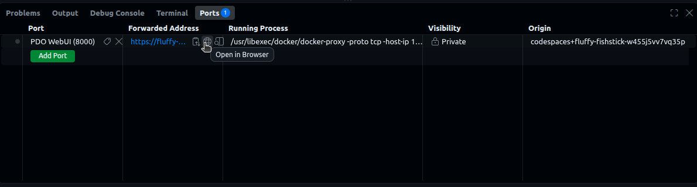

# End-to-End Tutorial: Federated, Policy-Gated Inference

This tutorial walks you through the **entire flow using a web UI**. By the end, a **Script Owner** runs one piece of code across **two hospitals at once** and never sees either of their datasets. Neither dataset leaves the **Guardian** that holds it; the code travels to the data instead, and only aggregate numbers come back. Each hospital has independently decided what it will allow, and the two have decided differently.

If you have not done the [download tutorial](tutorial.md) yet, do that one first. It introduces wallets, issuer objects, credentials and policies with a simpler flow. This tutorial assumes those terms.

---

## The story

Two hospitals each hold a patient cohort neither is willing to hand out to anyone, under any policy. Copies cannot be recalled. But each is willing to let approved code run *inside its own environment* and release aggregate results.

That is the shape of federated learning, and it changes the question a policy has to answer. A download policy asks **who is asking**. An inference policy also has to ask **what is going to run**, because approving a requester says nothing about the code they bring. And when there are two hospitals rather than one, a third thing follows: there is no central authority to ask. Each site answers the same request separately, with whatever policies it chose.

Four personas participate:

- A **Trusted Issuer** who vouches for code and for people (e.g., a data access committee, a code review board).
- **Two Dataset Owners** — Hospital A and Hospital B — who each publish their own cohort behind their own policies.
- A **Script Owner** who wants to run their analysis against both (e.g., a researcher).

### The two policies

| Policy | The question it answers | Who attaches it |
| --- | --- | --- |
| **FL-DS** — disease-specific research | *what is this code for?* | Hospital A, and Hospital B |
| **FL-IS** — institution-specific restriction | *who is running it, and do they stand behind it?* | Hospital B only |

**Hospital A** is satisfied by a rule about the code. **Hospital B** wants that *and* a rule about the requester, so it attaches **both**. An asset can carry any number of policies: each becomes a subpolicy of its policy agent, the contract asks every one of them, and the request is allowed only if **all** of them allow it. Their credential requirements are unioned and their operations merged into one capability.

So a single request will be judged twice at Hospital B and once at Hospital A — and the Script Owner has to satisfy the union of what all of them ask for.

### What FL-DS reads

The code that is about to run must carry a declaration of what it is for, and that declared disease scope must overlap the owner's **allowed diseases** — here **`MONDO:0005148`** (type 2 diabetes mellitus). Two credentials, both about **the same script**:

| Credential | What it says about the script |
| --- | --- |
| `IntendedDataUseCredential` | the diseases this code is declared for |
| `ScriptHashCredential` | the digest identifying this code |

The digest is the part that makes the declaration mean anything. Without it, an in-scope declaration attached to one script could be presented alongside a completely different piece of code.

### What FL-IS reads

Five credentials, across two roles:

| Role | Credential | What it says |
| --- | --- | --- |
| **User** | `AffiliationCredential` | which institution the requester belongs to |
| **User** | `publicKeyCredential` | the requester's session key, so results can reach them |
| **User** | `WalletVerifyingKeyCredential` | which key the requester's wallet is registered with on the ledger |
| **Script** | `ScriptHashCredential` | the digest identifying the code (the same one FL-DS reads) |
| **Script** | `ScriptOwnershipCredential` | a wallet's claim that the script is **its** script |

Four of those come from issuer objects. The fifth — the ownership claim — is signed by the requester's **own wallet**, which is the interesting part. On its own, "this script is mine" is worth nothing: anyone can say it about anything. It becomes evidence because the policy checks that signature against the key in the `WalletVerifyingKeyCredential`, which *is* from an authority. So the chain is: an authority says *this wallet holds this key*, the wallet uses that key to say *this script is mine*, and an issuer says *this wallet belongs to that institution*. All three must be about one wallet, and the ownership claim must be about the same script the digest names.

---

## The Cast: 4 Roles

Everything runs against a single client identity at a time. You change roles by switching the identity in the navbar.

| Role | What they do |
| ------ | -------------- |
| **`data_user`** | is the **Script Owner**. They publish the script as an asset, get a **wallet**, claim the script with it, and later ask for the run. |
| **`vc_issuer`** | is the **Trusted Issuer**. They hand-sign the credentials about the script and about the requester, and create the session-key issuer that binds a fresh key to the requester's wallet. |
| **`hospital_a`** | is the first **Dataset Owner**. Cohort behind an inference guardian, FL-DS attached. |
| **`hospital_b`** | is the second **Dataset Owner**. Own cohort, own guardian, and **both** policies. |

> **🔁 "Switch identity" callout** — Whenever you see this, use the **Identity dropdown at the top-right of the navbar** and pick the username. The page reloads as that identity and returns you to the home page.

!!! note "Useful terminologies"

    - **Guardian** — the service standing in front of an asset. This tutorial uses two kinds:
        - **Public** — hands the file to anyone who asks, with no policy at all. The script lives behind one of these, because the whole point of a script is that everyone can read the code being judged.
        - **Inference** — never hands the data out. It releases it only to an FL client on its own host, and only against a capability naming the digest of the code about to run.
    - **Script asset** — a script registered as an asset. It has its own identity (a DID), and the credentials *about the code* live on it, exactly as a person's credentials live in their wallet. Its DID is also how the runner finds the public guardian to fetch the code from — one identity settles both.
    - **Digest** — `sha256:<hex>` over the script's bytes. The policy approves a digest; every FL client re-computes it from the code it actually holds.
    - **FL server** — the job board every site connects to. It knows nothing about PDO. A requester submits a **round** to it; it hands each site the capability minted for that site.
    - **FL client** — runs next to a guardian, inside one data holder's environment. It is the party that turns a *claim* about code into a *fact* about code.
    - **Site** — one dataset, behind one inference guardian, with one FL client announcing it.
    - **Round** — one script, several sites, one submission.

### How the FL server knows whose capability is whose

This is the one piece of plumbing worth understanding before you start, because it is what makes a round over several sites possible at all.

A capability is minted by **one** asset's policies, for **one** guardian, and is refused at every other guardian. So when the webapp hands an FL server several capabilities at once, the server cannot simply give them out to whoever asks first — nearly every such handout would be a site receiving a capability it cannot redeem.

The answer is that each site says who it is:

```text
inference guardian starts  ──►  its FL client announces { client_id, asset_did }
                                                               │
                                     the DID of the asset it sits in front of
                                                               ▼
Federated tab  ◄── GET /clients ──  FL server  ── one entry per connected site
   │ joins that list against the asset registry, on the DID
   ▼
round submitted: [ { asset_did: A, capability: cap_A },
                   { asset_did: B, capability: cap_B } ]
                                                               │
                                       each job addressed to a DID
                                                               ▼
                        the client that announced DID A gets cap_A, and only that
```

The asset's DID is passed to the guardian when it is deployed, which is why registering an asset creates its identity contract *before* starting its guardian. Nothing here is a trust decision: announcing a DID gets you the job for it, and a capability you can only redeem if you really are that guardian.

---

## Part 0 — Start the demo app

### Running in cloud via GitHub Codespaces

You can launch a preinstalled [Codespace](https://github.com/features/codespaces) cloud environment by clicking this button:

[](https://codespaces.new/mlcommons/policy_fabric?ref=main){ target="_blank" rel="noopener" }

The devcontainer automatically brings up the policy engine, registries, the FL server and the webapp, and creates the tutorial files for you. The first start pulls several images, so give it a few minutes — progress shows in the Codespaces log.

When it finishes, click the forwarded **port 8000** (in the **Ports** tab) to open the webapp. Hover the forwarded address and click the globe icon to open it in a browser.



### Running it on your own machine

`onboarding.md` at the root of the repo has the full recipe. Either way, **the FL server must already be running** before any cohort is registered: an inference guardian announces itself to it the moment it starts, and a site that never announced is a site no round can reach.

### The files this tutorial uses

All of them are **already created for you**:

| File | What it is |
| --- | --- |
| `/tmp/hospital_a_cohort.csv` | Hospital A's dataset. It stays behind A's guardian and is never handed out. |
| `/tmp/hospital_b_cohort.csv` | Hospital B's dataset. Different patients, more of them; never pooled with A's. |
| `/tmp/inference_script.py` | the script. It computes a cohort summary and prints aggregate metrics. |

The startup log also printed the script's digest. If you missed it, get it back with:

```bash
echo "sha256:$(sha256sum /tmp/inference_script.py | awk '{print $1}')"
```

> 📋 **Keep this as `SCRIPT_DIGEST` in your notes.**

---

## Part 1 — Script Owner: publish the script and claim it

> **🔁 Switch identity to `data_user`.**

Everything the issuer signs in Part 2 is *about* the script or *about* this requester, so both need to exist first.

### 1.1 Register the script as an asset

1. Go to **Assets** (navbar) → **+ Register Asset**.
2. Fill the form:
      - **Name:** `cohort_summary_script`
      - **Data Path:** `/tmp/inference_script.py`
      - **Guardian Type:** **Public**
      - **Serve On:** leave as `0.0.0.0`
      - **Port:** `7910`
3. Click **Register Asset**.

### 1.2 Copy the script's DID

1. Back on **Assets**, click **Open** on `cohort_summary_script`.
2. Under **Asset Info**, copy the **DID**.

> 📋 **Keep this as `SCRIPT_DID` in your notes.**

*What's happening in the background:* a script that is going to be judged has to be **nameable** and **fetchable**. Registering it as an asset gives it both: an identity contract (so credentials can be about it, and presented from it) and a public guardian its bytes can be pulled from. There is deliberately no policy on it.

### 1.3 Create a wallet

1. Go to **Wallets** (navbar) → **+ Create Wallet**. **Name:** `researcher_wallet` → **Create**.
2. **Copy DID** from the new card.

> 📋 **Keep this as `WALLET_DID` in your notes.**

This is where credentials *about the requester* will live. Hospital A will never look at it; Hospital B will.

### 1.4 The wallet claims the script

1. Click **Open** on `researcher_wallet`, then **Sign Credential**.
2. Fill the modal:
      - **Credential Template:** `ScriptOwnershipCredential`
      - **Subject DID:** the `SCRIPT_DID` from step 1.2 — the claim is *about the script*
      - **Claims:**

        ```json
        {
          "ownedBy": "PASTE_YOUR_WALLET_DID_HERE"
        }
        ```

3. Click **Sign & Issue**. The credential is stored on the **script asset**, because that is what it is about.

*What's happening in the background:* a wallet cannot issue a credential the way an issuer object does — signing *from a signing context* is what makes something an authority, and a wallet is not one. What every contract does have is the key pair PDO generated for it at creation, whose public half the ledger records in the contract's metadata. That is the key this signature uses, and it is exactly the key the wallet key authority will certify in Part 2. Signed with anything else, FL-IS would have nothing to check the claim against.

---

## Part 2 — Trusted Issuer: vouch for the code and for the requester

> **🔁 Switch identity to `vc_issuer`.**

### 2.1 Create the issuer object

1. Go to **Issuers** (navbar) → **+ Create Issuer**.
2. **Name:** e.g. `code review board`. **Issuer Type:** **Manual**. → **Create**.
3. Open it and click **Copy** next to its **DID**.

> 📋 **Keep this as `ISSUER_DID` in your notes.** Both hospitals will decide, separately, to trust it.

### 2.2 Issue the **ScriptHashCredential**

1. On the issuer object's page click **Sign Credential**.
2. Fill the modal:
      - **Credential Template:** `ScriptHashCredential`
      - **Subject DID:** the `SCRIPT_DID` from step 1.2
      - **Claims:**

        ```json
        {
          "scriptHash": "sha256:PASTE_YOUR_SCRIPT_DIGEST_HERE"
        }
        ```

        Use the `SCRIPT_DIGEST` you kept in Part 0 — including the `sha256:` prefix.

3. Click **Sign & Issue**.

*What's happening in the background:* this pins the identity of the code. Both policies read it — it is the one credential they share.

### 2.3 Issue the **IntendedDataUseCredential**

1. **Sign Credential** again.
2. Fill:
      - **Credential Template:** `IntendedDataUseCredential`
      - **Subject DID:** the same `SCRIPT_DID`
      - **Claims:**

        ```json
        {
          "useOnlyFor": {
            "purposes": ["research"],
            "diseases": ["MONDO:0005148"]
          }
        }
        ```

3. **Sign & Issue**.

*What's happening in the background:* this attests **what the code is for**. Note the subject: the declaration is attached to the *script*, not to the person asking. When the data never moves, the thing whose purpose matters is the thing that runs.

### 2.4 Issue the **AffiliationCredential**

1. **Sign Credential** again.
2. Fill:
      - **Credential Template:** `AffiliationCredential`
      - **Subject DID:** the `WALLET_DID` from step 1.3 — this one is about the *person*, so it goes to their wallet
      - **Claims:**

        ```json
        {
          "isMemberOf": "did:example:best_university",
          "typeOfMembership": "faculty"
        }
        ```

3. **Sign & Issue**.

### 2.5 Add a session-key issuer

1. Go to **Issuers** → **+ Create Issuer**.
2. **Name:** `session keys`. **Issuer Type:** **Session Key**. → **Create**.
3. Back on the list you now have **two** new cards: `session keys` (*External Key Authority*) and `session keys (wallet keys)` (*Wallet Key Authority*). **Copy DID** from each.

> 📋 **Keep these as `BINDING_DID` and `WALLET_KEY_DID` in your notes.**

*What's happening in the background:* creating a session-key issuer creates two objects, because two different facts have to be attested. The **wallet key authority** reads a wallet's ledger record and certifies which verifying key that wallet is registered with — that is the `WalletVerifyingKeyCredential`, and it is what makes the wallet's own signature from step 1.4 checkable. The **external key authority** then uses that credential to bind a fresh session key to the wallet and issue a `publicKeyCredential` for it, automatically, at request time. Neither has a "Sign Credential" button; there is nothing to do with them by hand.

**Important**: none of these signed credentials unlocks anything on its own. A policy accepts them only if the claims fit **and** the credential was signed by an issuer object *that policy* trusts. Each hospital decides that for itself, next.

---

## Part 3 — Hospital A: one policy, about the code

> **🔁 Switch identity to `hospital_a`.**

### 3.1 Register the dataset (and start its inference guardian)

1. Go to **Assets** (navbar) → **+ Register Asset**.
2. Fill the form:
      - **Name:** `hospital_a_cohort`
      - **Data Path:** `/tmp/hospital_a_cohort.csv`
      - **Guardian Type:** **Inference**
      - **Serve On:** leave as `0.0.0.0`
      - **Port:** `7900`
3. Click **Register Asset**. This takes longer than a public guardian — the app is starting a container that brings up a storage service, the guardian core, and the FL client that sits beside it, and waits for all of it to answer.

*What's happening:* registering the asset first mints its identity contract, so the asset has a DID, and then starts an **inference guardian** on `/tmp/hospital_a_cohort.csv` **carrying that DID**. Unlike the download guardian, it has no operation that hands the file to a remote caller at all. Its one capability handler, `do_inference`, releases the data over loopback to the FL client bundled with it — and only when the digest that client reports matches the one the capability authorizes. That FL client, meanwhile, announces the DID to the FL server, which is how this hospital becomes a site anyone can address a round to.

### 3.2 Expose the dataset behind FL-DS

1. Still on `hospital_a_cohort`, click **Expose** → the **Expose Asset** modal opens.
2. Under **Policies**, check **FL-INFERENCE-DISEASE-SPECIFIC-RESEARCH**. (Use **View** to read the policy card and its Rego source.)
3. The **Policy Data** box auto-fills with that policy's schema. Replace it with real values:

    ```json
    {
      "allowedDiseases": ["MONDO:0005148"]
    }
    ```

4. Under **Trusted Issuers**, click **+ Add a trusted issuer** **once**:
      - paste `ISSUER_DID` from step 2.1 into the DID field
      - check **`ScriptHashCredential`** and **`IntendedDataUseCredential`**
5. Click **Create Policy & Expose**.

Hospital A is done. It asks nothing about who is requesting, so it never needs to trust the session-key issuers at all.

---

## Part 4 — Hospital B: the same, plus a rule about the requester

> **🔁 Switch identity to `hospital_b`.**

### 4.1 Register the dataset

1. **Assets** → **+ Register Asset**:
      - **Name:** `hospital_b_cohort`
      - **Data Path:** `/tmp/hospital_b_cohort.csv`
      - **Guardian Type:** **Inference**
      - **Serve On:** `0.0.0.0`
      - **Port:** `7902`
2. Click **Register Asset**.

### 4.2 Expose it behind **both** policies

1. **Open** `hospital_b_cohort` and click **Expose**.
2. Under **Policies**, check **both**:
      - **FL-INFERENCE-DISEASE-SPECIFIC-RESEARCH**
      - **FL-INFERENCE-INSTITUTION-SPECIFIC-RESTRICTION**

    Watch the **Policy Data** box as you check the second one: it now shows the **union** of the two schemas, because the asset has to supply data for both.

3. Replace **Policy Data** with:

    ```json
    {
      "allowedDiseases": ["MONDO:0005148"],
      "allowedInstitutions": ["did:example:best_university"]
    }
    ```

4. Under **Trusted Issuers**, click **+ Add a trusted issuer** **three times**:
      - **First box:** `ISSUER_DID` (step 2.1) — check **`ScriptHashCredential`**, **`IntendedDataUseCredential`** and **`AffiliationCredential`**
      - **Second box:** `BINDING_DID` (step 2.5) — check **`publicKeyCredential`**
      - **Third box:** `WALLET_KEY_DID` (step 2.5) — check **`WalletVerifyingKeyCredential`**
5. Click **Create Policy & Expose**.

Note what is *not* in that list: the requester's wallet. It never becomes a trusted issuer, and it does not need to be — FL-IS hands its key to the contract along with the ownership credential, and the check happens against that key directly.

*What's happening in the background:* both policies are provisioned as subpolicies of **one** policy agent contract. At request time the contract evaluates each one over the same presentation and merges what they return: the request is allowed only if **both** allowed, the credentials each of them relied on are collected and verified once, and their two `do_inference` operations deep-merge into one — FL-DS's `script_digest` and FL-IS's `channel_key` end up as parameters of the same capability.

The two hospitals have agreed about nothing except, coincidentally, the same disease code and the same issuer. Hospital B additionally demands to know who is asking.

---

## Part 5 — Script Owner: one round across both

> **🔁 Switch identity to `data_user`.**

1. Go to **Federated** (navbar). The page connects to the FL server it was configured with and lists the sites whose FL clients are connected. You should see **two**: `hospital_a_cohort` and `hospital_b_cohort`, both `ready`.

    If a site is missing, its FL client has not announced itself — check that the FL server was running when the guardian started.

2. Both are selected by default. Leave them both checked and click **Run on selected sites**.
3. The modal asks for **two** roles — the union of what the selected policies want:
      - **Script** → `cohort_summary_script` (under **Scripts**)
      - **User** → `researcher_wallet` (under **Wallets**)

    Hospital A's FL-DS only reads the `Script` role and ignores the other; Hospital B's pair reads both.

4. Click **Request Federated Inference**.
5. Watch the steps go by — one per site for the capability, one per site for the run — and then the result:

    ```json
    {
      "sites": 2,
      "sites_failed": 0,
      "total_samples": 722,
      "accuracy": 0.42,
      "loss": 1.23
    }
    ```

    and below it, what each hospital reported on its own. (The FL client in this demo reports fixed accuracy and loss rather than really executing the script; `samples` is the size in bytes of the cohort it was handed — 295 at Hospital A and 427 at Hospital B, which is why the total is 722. What is real is everything up to that point: the approvals, the digest checks, the releases, and the fact that the two numbers were combined without either file moving.)

*What's happening in the background* (the whole handshake, end to end):

1. The app resolves `SCRIPT_DID` through the asset registry to the script's public guardian and **fetches the code**, once, for the whole round.
2. **Each hospital's policy agent is asked separately.** Hospital A's evaluates FL-DS: the two credentials presented from the script's identity were signed by an issuer *it* trusts, the declared disease overlaps *its* `allowedDiseases`, and both name the same script. Hospital B's evaluates FL-DS **and** FL-IS over the same presentation — and because FL-IS wants a `publicKeyCredential` the wallet does not have yet, the app first asks B's trusted external key authority for one, which gets a `WalletVerifyingKeyCredential` from the wallet key authority and then binds a fresh session key. Both land in the wallet. FL-IS then checks the affiliation, the session key, the wallet key and the self-signed ownership claim all name **one** wallet, and that the ownership claim and the digest name **one** script.
3. Each hospital issues its own **capability** for `do_inference`, carrying the **approved digest** and bound to its own guardian.
4. The app submits **one round** to the FL server: the script, and the two capabilities, each tagged with the DID of the asset it was minted for. It never contacts either guardian itself.
5. **Each FL client** claims the job addressed to the DID it announced, **hashes the script it received**, and posts its capability to its own guardian core over loopback with that measurement attached.
6. **Each guardian core** compares the digest its capability authorized against the digest its client computed. They match, so each releases its own cohort — to a process on its own host, over loopback.
7. Each client runs the script over its own data and reports **metrics** to the FL server, which combines them weighted by how much data each site ran over. That combination is the only place the two hospitals' numbers ever meet.

Neither dataset left its guardian's host. Nobody but each guardian ever held either one.

---

## End of Tutorial: What you just built

```text
issuer object ──signs──► ScriptHashCredential       (digest)          ─┐
              ──signs──► IntendedDataUseCredential  (diseases)         │ stored on
   wallet     ──signs──► ScriptOwnershipCredential  (this is mine)    ─┘ the script asset
                                                                       ── the "Script" role
issuer object ──signs──► AffiliationCredential      (institution)     ─┐
wallet key authority ──► WalletVerifyingKeyCredential (wallet's key)   │ stored in
session key issuer   ──► publicKeyCredential        (fresh key)       ─┘ researcher_wallet
                                                                       ── the "User" role
                                    │
                 the SAME presentation, judged independently
                                    │
            ┌───────────────────────┴───────────────────────┐
            ▼                                               ▼
   Hospital A's policy agent                    Hospital B's policy agent
     FL-DS                                        FL-DS  AND  FL-IS
     reads the Script role only                   reads both roles
     its own trusted issuers                      its own trusted issuers
     its own allowedDiseases                      allowedDiseases + allowedInstitutions
            │                                               │
            ▼                                    both must allow; operations merge
     capability for A                                       ▼
     { do_inference, script_digest }              capability for B
            │                              { do_inference, script_digest, channel_key }
            └───────────────────────┬───────────────────────┘
                                    │ submitted together, each tagged with its asset DID
                                    ▼
                                FL server ── gives each client the capability for the
                                    │         DID that client announced
            ┌───────────────────────┴───────────────────────┐
            ▼                                               ▼
     FL client at A                                  FL client at B
     re-hashes the code                              re-hashes the code
            ▼                                               ▼
     guardian A releases ONLY if                     guardian B releases ONLY if
     measured == approved digest                     measured == approved digest
            └───────────────────────┬───────────────────────┘
                                    ▼
                          metrics, aggregated  ──►  data_user
```

Neither **Dataset Owner** reviewed the requester by hand, neither **Guardian** evaluated a policy, neither **Policy** saw any data, the **FL server** understood none of it, and neither dataset moved. What crossed each boundary was a digest on the way in and a handful of numbers on the way out — and the only place the two hospitals' numbers met was in the aggregate.

The wallet, meanwhile, is never an authority. It gets to assert something about itself only because someone else, independently, put its key on the record — which is the whole reason Hospital B can rely on a claim the requester made about themselves.

---
